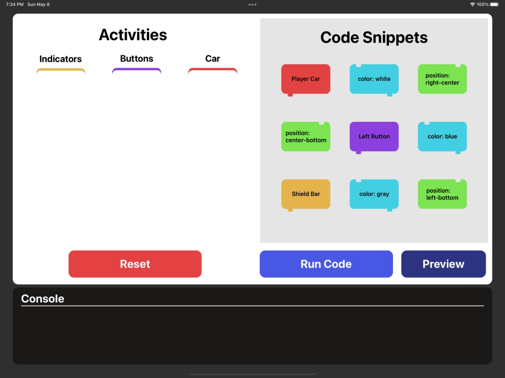
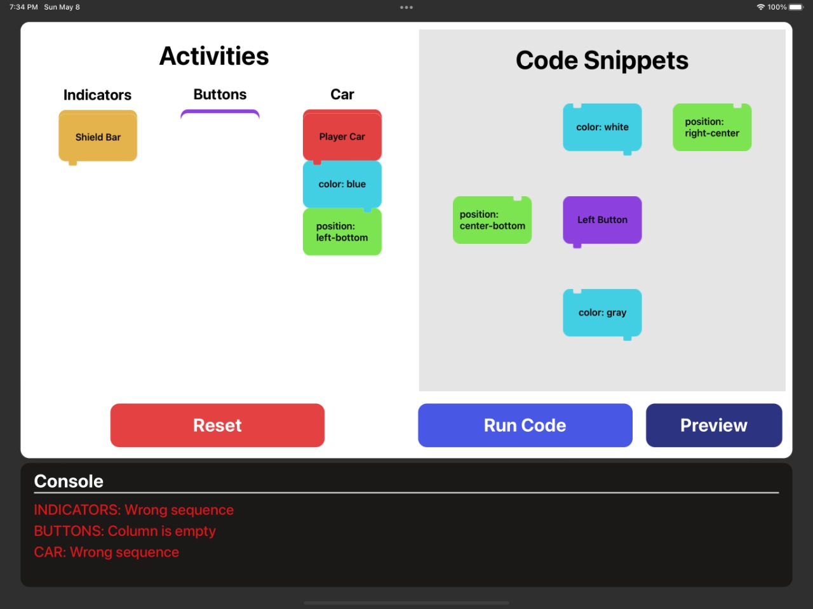
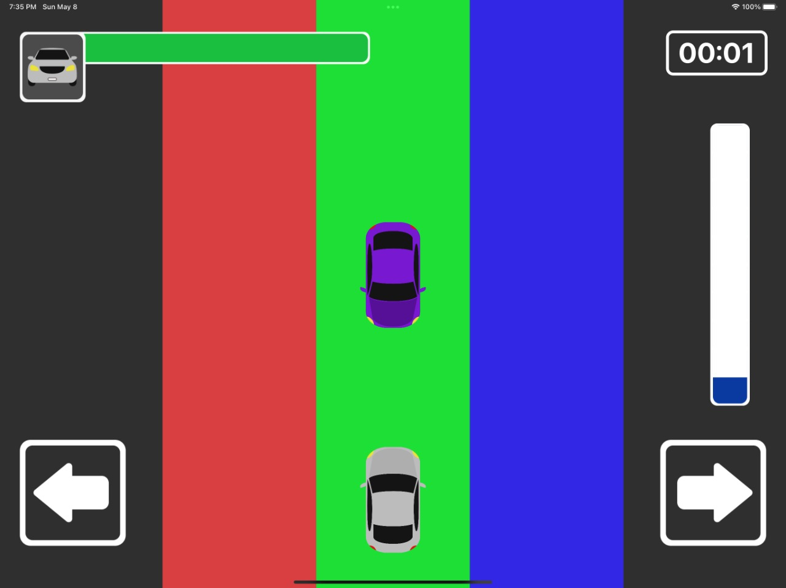
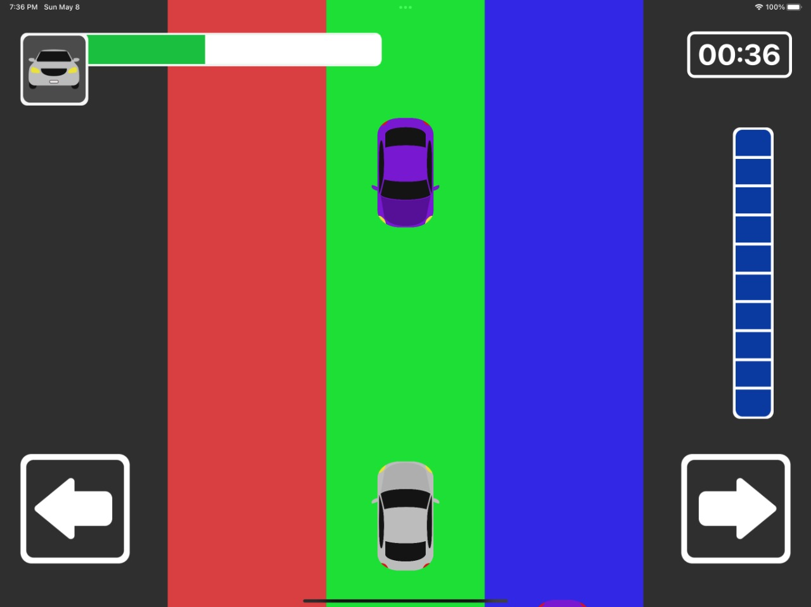

# Be a Game Developer
This is my WWDC 2022 Swift Student Challenge submission

## About the project

My motivation to create this project was my passion for programming and games, so I decided to develop a project that could give the feeling of programming your own game.

The first part of the app is a simulation of an IDE, where you can drag cards from *Code Snippets* and drop into the columns of *Activities*. In any moment you can run your code and validate by console if your cards are in the correct position, to be sure about cards position you have to access the prototype visualization by preview button. If everything is in the correct place, you will be able to test the game that you programmed.

The second part is a endless game, where you have to survive for as long as possible and you have a shield that is incresed gradually, when the shield bar is full your life bar isn't decresed by cars collision, so you have the opportunity to gain a little more time.

## Technologies
- SwiftUI
- SpriteKit
- MVVM Architecture

## Screenshots

